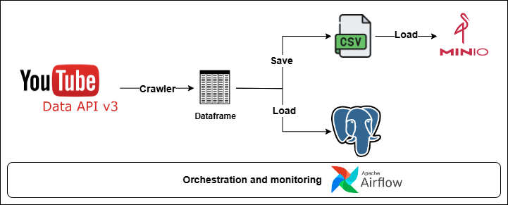

Project: YouTube API Data Crawler
========

Project Overview
================

- This project involves crawling data from the YouTube API.
- The data is ingested from YouTube using the API.
- The data is transformed before being loaded.
- The data is saved into CSV files and then uploaded to MinIO.
- The data is also loaded into a PostgreSQL database (Schema is automatically defined, and the table is created if it does not already exist).

Information channel crawler
================

- Channel name: Duy Luân Dễ Thương
- URL: https://www.youtube.com/@duyluandethuong
- Content crawler:
    - Channel overview
    - All videos
    - Playlists
    - Video in Playlist
    - Video Details
    - Video Comments (include Replies)

Architecture
================

