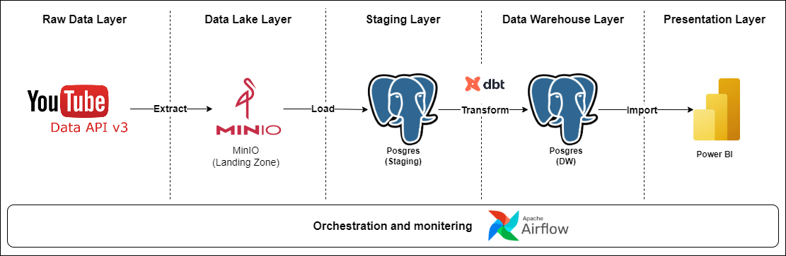
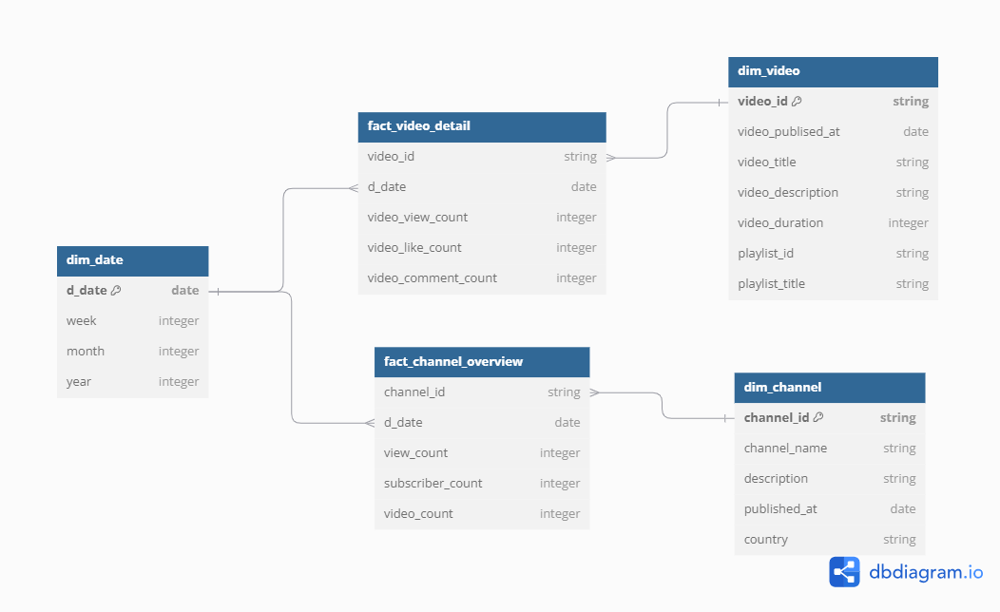
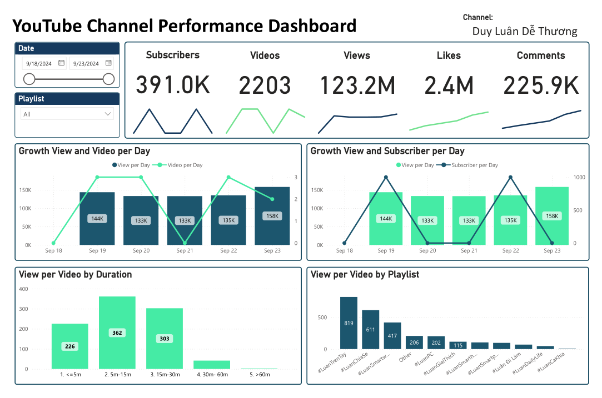

Project: YouTube API Data Crawler
========

Project Overview
================

- This project involves crawling data from the YouTube API.
- The data is ingested from YouTube using the API.
- The data is extracted and load into MinIO (Landing Zone - Data Lake).
- The data is load incremental into Postgres (Staging).
- Transform data using DBT to create dimension and fact for Data Warehouse
- Using Power BI to build Dashboard YouTube channel performance

 

Architecture
================

 

Information Channel Crawler
================

- Channel name: Duy Luân Dễ Thương
- URL: https://www.youtube.com/@duyluandethuong
- Content crawler:
    - Channel overview
    - All videos
    - Playlists
    - Video in Playlist
    - Video Details
    - Video Comments (include Replies)

 

Landing Zone Layer
================

- Extract the full data from YouTube. For video Comments (include replies), extract only rows where updated_at is greater than the checkpoint.
- Extract the data and save it as parquet files into MinIO each day, with the path partitioned by object/yyyy/mm/dd/objectyyyymmdd.parquet.

 

Staging Layer
================

- Create partterns to load data into Postgres (Staging) including: overwrite (SCD type 1), overwrite_daily, append and upsert (SCD type 2):
    - Channel overview: Use the overwrite_daily strategy. Because views, videos and subscribers change over time. Save a new row each day to track changes by date.
    - All videos: Use the overwrite strategy. Because this data changes litle over time.
    - Video Details: Use the overwrite_daily strategy. Because views, likes and comments change over time. Save a new row each day to track changes by date.
    - Playlists: Use the overwrite strategy. Because this data changes litle over time.
    - Video in Playlist: Use the overwrite strategy. Because this data changes litle over time.
    - Video Comments (include Replies): Use the append strategy. Because updates are not frequent.
- Use incremental load to load data into Posgres. After each load, save a checkpoint. If last_modified > checkpoint, load the new data into Posgres.

 

Data Warehouse Layer
================

 

Presentation Layer
================
